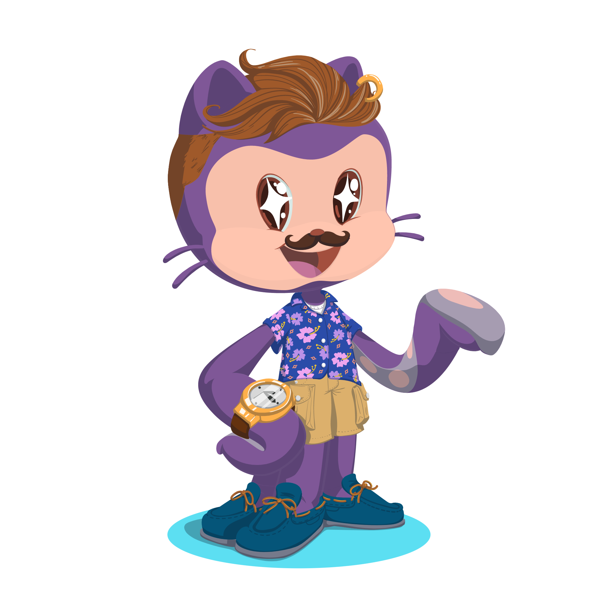

&nbsp;

 
 

<h2 align="justify">Algoritmos com JavaScript</h2>
<h2 align="justify">Feito por : Thiago Zambelli</h2>
<h3 align="justify">Aprofundando em algoritmos de ordenação e busca</h3>
 
  

- [Projeto](#projeto)
- [Problemas e Soluções](#problemas__solucoes)
- [Aulas](#aulas)

---

# Aulas -> 

## Aula 1 -

- Podemos pensar em novas formas de “atacar” um problema de ordenação, começando a partir de partes menores já ordenadas e unindo estas partes em uma única lista ordenada;
- Evoluímos o conceito e testamos o funcionamento do algoritmo com uma simulação sem código, similar ao “teste de mesa”, para entendermos quais operações deverão ser feitas pelo código durante o fluxo de execução do programa;
- Após utilizarmos a simulação para entendermos o fluxo do algoritmo e o que ele deve fazer, desenvolvemos um código em JavaScript para implementá-lo através da função juntaListas(), que percorre cada uma das duas listas informadas por parâmetro, compara os valores de cada uma, posiciona estes valores em uma lista única de acordo com o resultado da comparação e, por fim, retorna a lista unida.